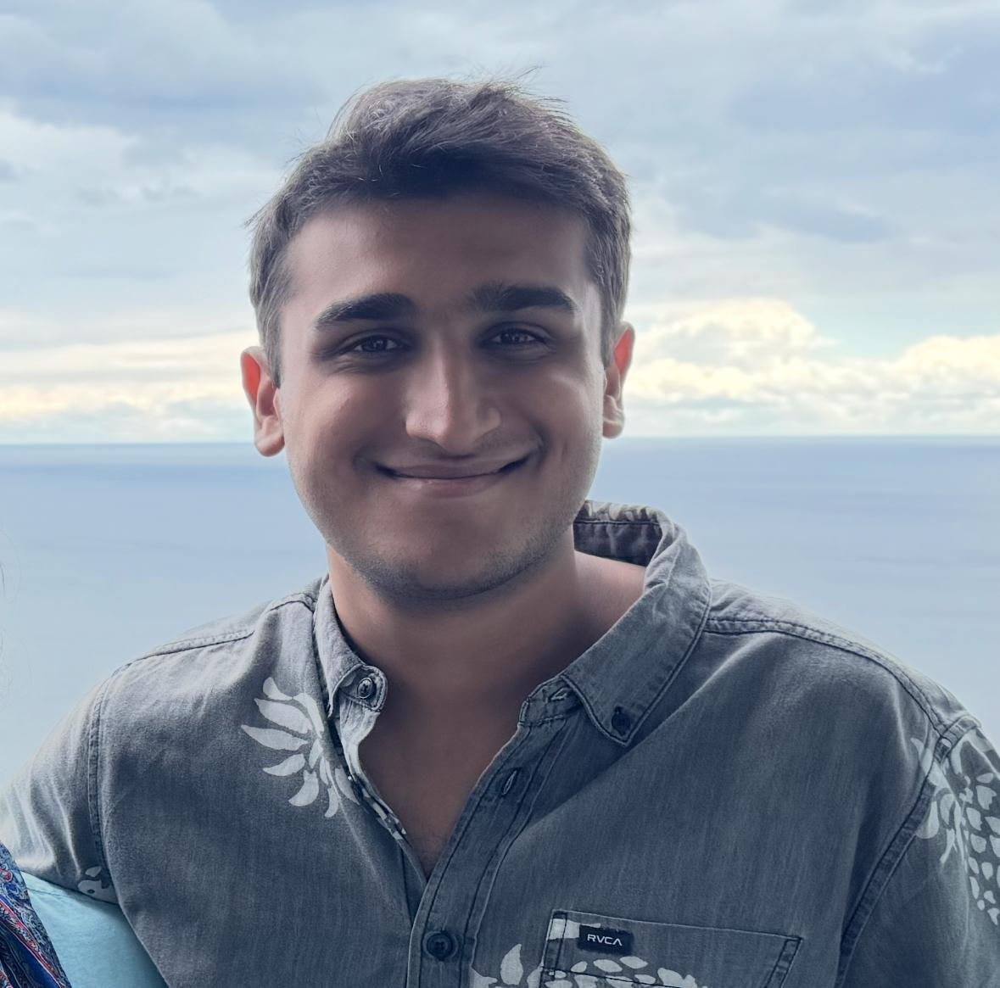

# TODO - Headshot Integration

## Completed Changes:
1. ✅ Added `.hero-image` container with the headshot in HTML
2. ✅ Added two-column layout (text left, image right)
3. ✅ Applied grayscale(100%) filter by default
4. ✅ Applied grayscale(0%) on hover
5. ✅ Made image smaller (400x400px) and rounded (50%)
6. ✅ Added responsive styles for mobile
7. ✅ Centered text content with respect to buttons
8. ✅ Positioned image towards the right side of screen
9. ✅ Increased image size slightly (400px instead of 280px)

## Revert Instructions:
To revert in a single prompt, remove:

**In index.html:** Remove lines 69-71:
```html
<div class="hero-image">
    
</div>
```

**In css/style.css:** 
- Remove `gap: 4rem;` from `.hero`
- Change `.hero-content` `text-align: center;` to `text-align: left;` and remove `flex: 1;`
- Remove the entire `.hero-image` block
- Remove the entire `.headshot` block
- In @media query, remove the `.hero`, `.hero-content`, and `.hero-image` responsive blocks

